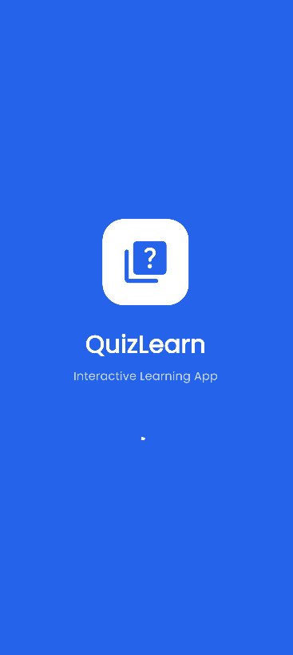
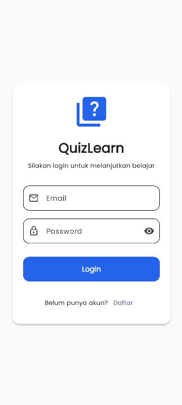
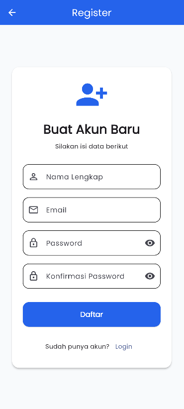
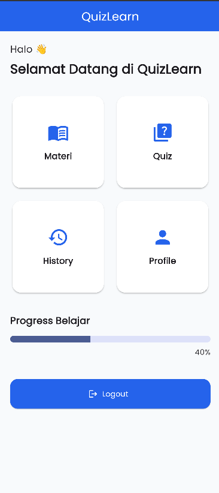
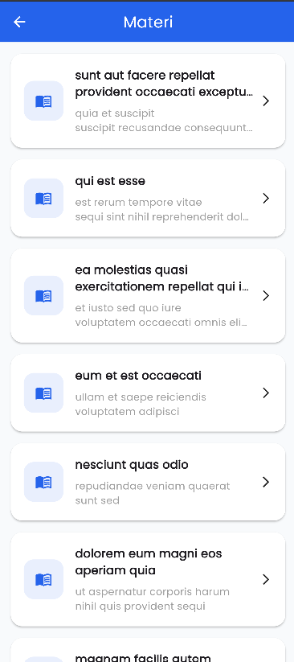
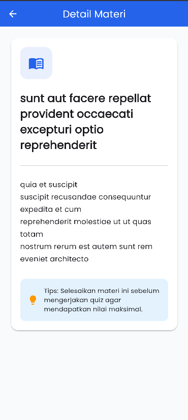
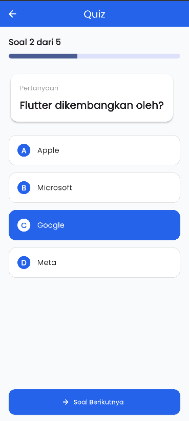
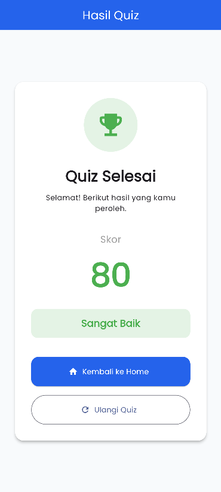
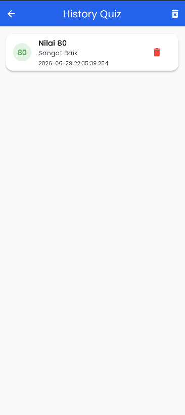
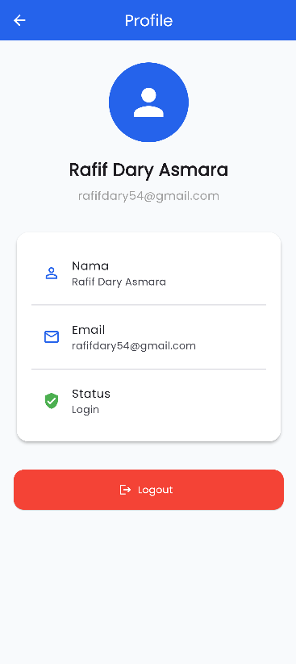

QuizLearn - Aplikasi Edu-Tech Berbasis Flutter

Deskripsi:

QuizLearn merupakan aplikasi mobile berbasis Flutter yang dikembangkan sebagai tugas akhir mata kuliah Pengembangan Aplikasi Bergerak. Aplikasi ini mengusung tema Edu-Tech / Platform Pembelajaran, yang menyediakan materi pembelajaran berbasis teks serta kuis interaktif untuk menguji pemahaman pengguna.

Aplikasi telah menerapkan autentikasi menggunakan Firebase Authentication, manajemen state menggunakan Provider, integrasi REST API, penyimpanan data lokal menggunakan SharedPreferences, serta Local Notification sebagai implementasi fitur native Android.

Fitur Utama:
* Login
* Register
* Logout
* Splash Screen
* Materi Pembelajaran
* Detail Materi
* Quiz Interaktif
* Perhitungan Skor Quiz
* Riwayat (History) Quiz
* Profil Pengguna
* Penyimpanan Session Login
* Local Notification
* Integrasi REST API (GET, POST, PUT, DELETE)

Teknologi yang Digunakan:
* Flutter
* Dart
* Firebase Authentication
* Provider (State Management)
* HTTP Package
* SharedPreferences
* Flutter Local Notifications
* REST API (DummyJSON)
* Arsitektur Aplikasi

Aplikasi menggunakan arsitektur sederhana dengan pemisahan tanggung jawab (Separation of Concerns), sehingga kode lebih mudah dipelihara dan dikembangkan.

Struktur folder:

lib/
│
├── models/
├── providers/
├── screens/
├── services/
├── utils/
├── widgets/
│
├── app.dart
├── firebase\_options.dart
└── main.dart

Keterangan:
* models/ : Menyimpan model data aplikasi.
* providers/ : Mengelola state aplikasi menggunakan Provider.
* screens/ : Berisi seluruh halaman aplikasi.
* services/ : Berisi layanan Firebase, REST API, Notification, dan penyimpanan data.
* utils/ : Berisi konfigurasi warna, tema, dan routing.
* widgets/ : Berisi widget yang dapat digunakan kembali (reusable widgets).

Panduan Instalasi

1. Clone Repository: git clone https://github.com/USERNAME/NAMA\_REPOSITORY.git
2. Masuk ke Folder Project cd NAMA\_REPOSITORY
3. Install Dependency flutter pub get
4. Jalankan Aplikasi
* Untuk Web (Chrome):
* flutter run -d chrome
5. Untuk Android:
* flutter run
* Build APK
* flutter build apk --release
* Hasil build berada pada folder: build/app/outputs/flutter-apk/app-release.apk

Struktur Navigasi:

Splash Screen
↓
Login / Register
↓
Home
├── Materi
├── Quiz
├── History
└── Profile

Screenshot Aplikasi

1. Splash Screen

2. Login

3. Register

4. Home

5. Materi

6. Detail Materi

7. Quiz

8. Hasil Quiz

9. History

10. Profile

Pengembang
Nama : Rafif Dary Asmara
NBI  : 1462300182
Program Studi : Teknik Informatika
Universitas : Universitas 17 Agustus 1945 Surabaya
Mata Kuliah : Pengembangan Aplikasi Bergerak
Tahun : 2026